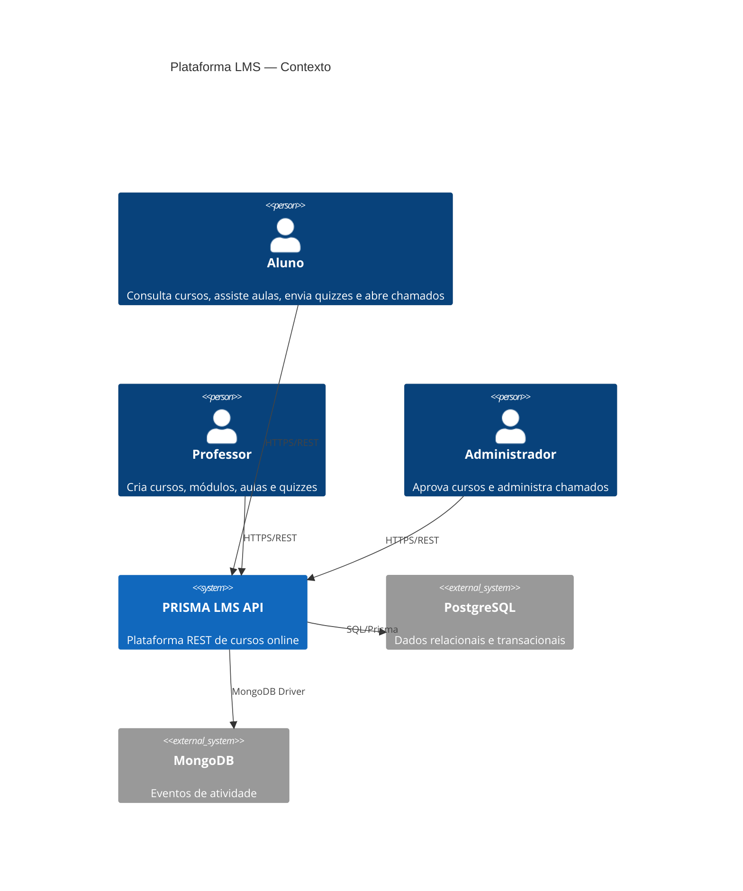

# C4 — Diagrama de Contexto

```mermaid
C4Context
  title Plataforma LMS — Contexto
  Person(aluno, "Aluno", "Consulta cursos, assiste aulas, envia quizzes e abre chamados")
  Person(professor, "Professor", "Cria cursos, módulos, aulas e quizzes")
  Person(admin, "Administrador", "Aprova cursos e administra chamados")
  System(lms, "PRISMA LMS API", "Plataforma REST de cursos online")
  System_Ext(postgres, "PostgreSQL", "Dados relacionais e transacionais")
  System_Ext(mongo, "MongoDB", "Eventos de atividade")
  Rel(aluno, lms, "HTTPS/REST")
  Rel(professor, lms, "HTTPS/REST")
  Rel(admin, lms, "HTTPS/REST")
  Rel(lms, postgres, "SQL/Prisma")
  Rel(lms, mongo, "MongoDB Driver")
```
