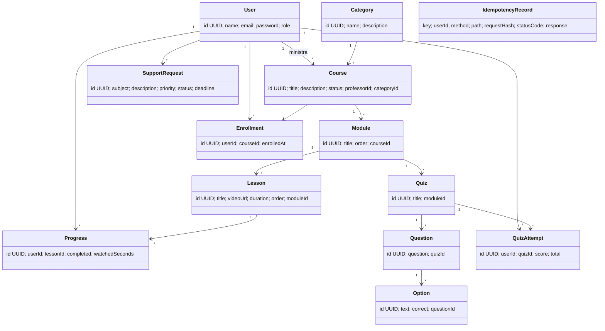
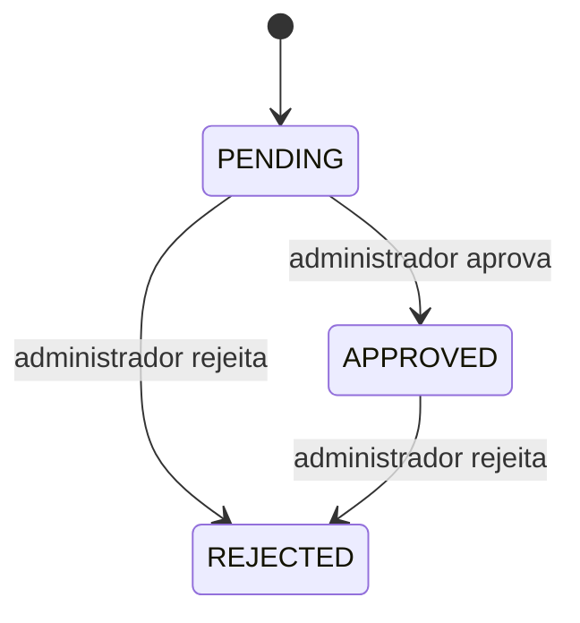
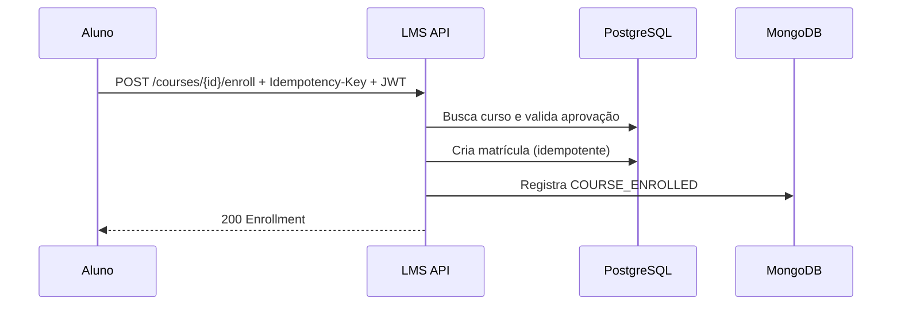

# Modelagem de Dados

## Diagrama de classes/entidades

```mermaid
classDiagram
  class User { id UUID; name; email; password; role }
  class Course { id UUID; title; description; status; professorId; categoryId }
  class Category { id UUID; name; description }
  class Module { id UUID; title; order; courseId }
  class Lesson { id UUID; title; videoUrl; duration; order; moduleId }
  class Enrollment { id UUID; userId; courseId; enrolledAt }
  class Progress { id UUID; userId; lessonId; completed; watchedSeconds }
  class Quiz { id UUID; title; moduleId }
  class Question { id UUID; question; quizId }
  class Option { id UUID; text; correct; questionId }
  class QuizAttempt { id UUID; userId; quizId; score; total }
  class SupportRequest { id UUID; subject; description; priority; status; deadline }
  class IdempotencyRecord { key; userId; method; path; requestHash; statusCode; response }

  User "1" --> "*" Course : ministra
  Category "1" --> "*" Course
  Course "1" --> "*" Module
  Module "1" --> "*" Lesson
  Module "1" --> "*" Quiz
  Quiz "1" --> "*" Question
  Question "1" --> "*" Option
  User "1" --> "*" Enrollment
  Course "1" --> "*" Enrollment
  User "1" --> "*" Progress
  Lesson "1" --> "*" Progress
  User "1" --> "*" QuizAttempt
  Quiz "1" --> "*" QuizAttempt
  User "1" --> "*" SupportRequest
```

## Estados de curso

```mermaid
stateDiagram-v2
  [*] --> PENDING
  PENDING --> APPROVED: administrador aprova
  PENDING --> REJECTED: administrador rejeita
  APPROVED --> REJECTED: administrador rejeita
```

## Sequência — matrícula

```mermaid
sequenceDiagram
  participant A as Aluno
  participant API as LMS API
  participant PG as PostgreSQL
  participant MG as MongoDB
  A->>API: POST /courses/{id}/enroll + Idempotency-Key + JWT
  API->>PG: Busca curso e valida aprovação
  API->>PG: Cria matrícula (idempotente)
  API->>MG: Registra COURSE_ENROLLED
  API-->>A: 200 Enrollment
```
